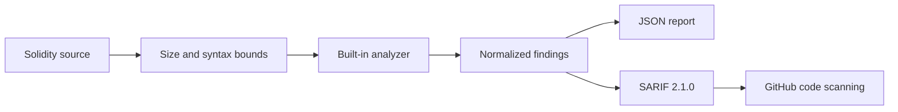

# Engineering case study

## Boundary

The hosted product performs deterministic source inspection only. It does not compile, deploy, execute, retain, or make network calls on behalf of submitted contracts. Slither, Mythril, webhooks, queues, and LLM review are excluded from the public deployment.

Each finding carries a stable rule ID, severity, confidence, SWC/CWE context when available, source span, remediation, analyzer provenance, and deterministic fingerprint.

## Five-minute demonstration

1. Open `/app/`; allow up to one minute for a free service cold start.
2. Scan the supplied vulnerable vault and inspect the reentrancy finding.
3. Replace it with `tests/fixtures/contracts/safe_contract.sol` and compare results.
4. Run `python cli.py tests/fixtures/contracts/vulnerable_reentrancy.sol --format sarif --output results.sarif`.
5. Inspect the CI SARIF validation and severity-gate jobs.

## Limitations

Regex and lightweight AST rules cannot prove contract safety or understand complete economic behavior. Findings require human review and this project does not replace professional auditing, fuzzing, symbolic execution, or formal verification.
